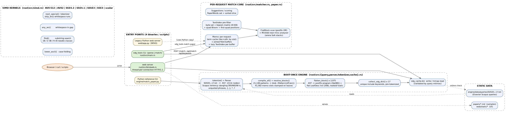
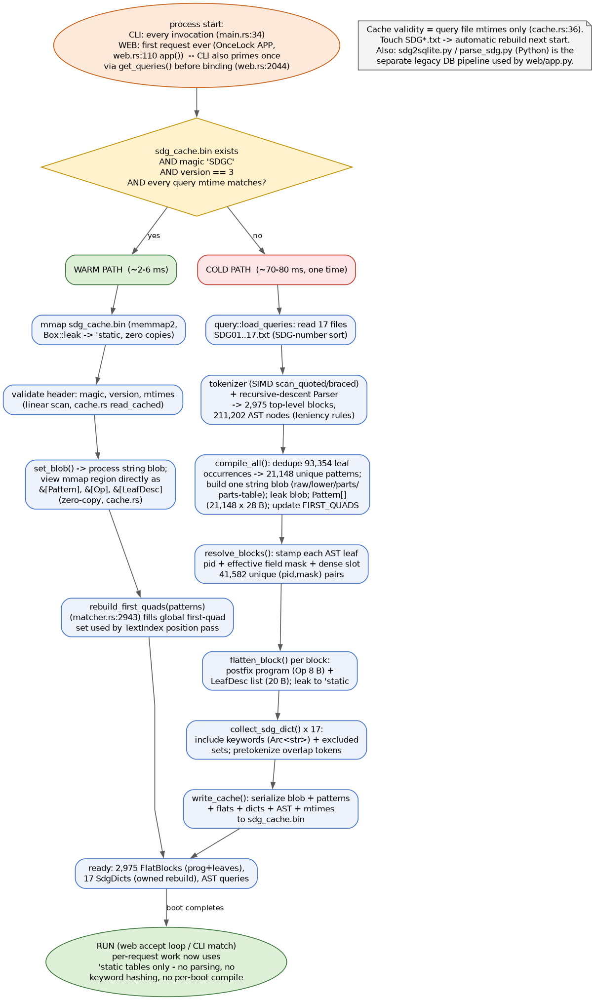
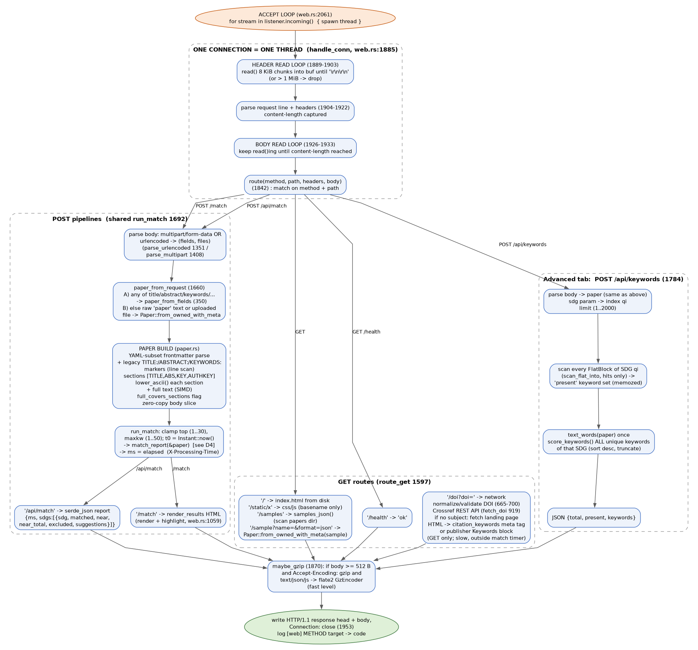
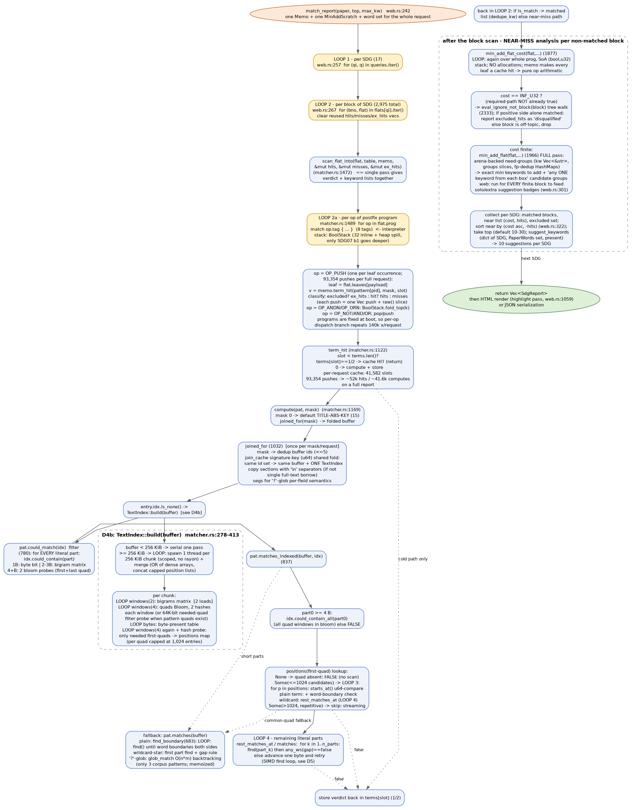
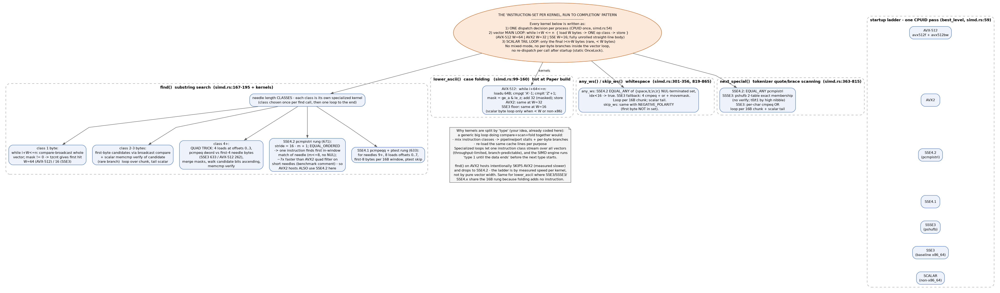

# SDG Paper Matcher — Complete Program Flow (all processes and all loops)

**Purpose of this document.** Map *every* process and *every* loop of this
codebase at the level of detail needed to optimize it: who calls whom, what
each loop iterates over, how many times per request (real corpus numbers), and
where the inner kernels live (file:line). It also explains the "one
instruction-set type, run to completion" pattern the code already uses in its
SIMD kernels and where that same idea is *not yet* applied to the boolean
interpreters — that is the gap list at the end (§8).

Version matches the repository as of this writing (`rust/src/*`, `engine/*`,
`web/*`). All line numbers are from those files.

---

## 0. Legend and measured corpus facts

**Legend.** A box with `LOOP k` = an iteration construct (always shown with its
trip count). A box with `(1x)` = runs once per scope shown. File:line references
are clickable-ish grep targets, e.g. `matcher.rs:1489`.

**Corpus facts used in every count below** (computed from the real
`engine/data/queries/SDG01..17.txt`):

| quantity | value | note |
|---|---|---|
| SDG query files | 17 | SDG01..SDG17.txt |
| top-level OR blocks | **2,975** | per-SDG: SDG10=1,222, SDG16=1,630, rest 3–19 |
| AST nodes total | 211,202 | after Scopus leniency parse |
| leaf (keyword) occurrences | 93,354 | every keyword *occurrence* in the corpus |
| unique patterns | **21,148** | dedup factor 4.41 (same keyword in many blocks) |
| unique (pid, field-mask) memo slots | **41,582** | the per-request term-cache size |
| keyword length | median 17 B, mean 17.6, max 128 | substring-search needle profile |
| wildcard terms (`*` / `?`) | 3,338 of 21,148 | 17,810 are plain whole-word terms |
| `?`-glob patterns | 3 | only these hit the O(n·m) glob path |
| boot cache | `sdg_cache.bin` v3, mmap'd | cold ~70–80 ms, warm ~2–6 ms |
| sample papers | 25 in `papers/` | typical request text: 0.5–10 kB; stress tests use ~1.8 MB |

The hot request path therefore does, per full `/match` report:
~93.4k leaf-push classifications, ≤ 41.6k real substring searches (rest are
memo hits), over 2,975 block scans, inside 17 SDG loops — and typically a
handful of TextIndex builds.

---

## 1. One-page map (L0)



```
                      +-----------------------------------------------+
                      |  STATIC DATA (per process lifetime)           |
                      |  engine/data/queries/SDG01..17.txt            |
                      |  papers/*.md   web/static/*   sdg_cache.bin   |
                      +--------------------+--------------------------+
                                           | read once at boot
+------------+   +------------+   +--------v---------+   +-----------------+
| sdg_tools  |   |  web server|   | BOOT-ONCE ENGINE |   | legacy Python   |
| CLI        |   |  bin/web.rs|   | query/parser/    |   | engine + web    |
| main.rs    |   |  thread/   |   | tokenizer/cache  |   | (reference,     |
| parse/match|   |  conn HTTP |   | AST->Patterns->  |   | 30x slower)     |
+-----+------+   +-----+------+   | Flats->Dicts     |   +--------+--------+
      |                |          +--------+---------+            |
      |                |                   | (21,148 patterns, 41,582 slots,
      |                |                   |  2,975 postfix programs, 'static)
      |                |                   v
      |                |     +-----------------------------+
      |                |     | PER-REQUEST MATCH CORE      |  matcher.rs
      +---------------------->| Memo (term cache)          |  paper.rs
                     |        | TextIndex pre-filter       |
                     +------->| FlatBlock postfix VM       |
                              | MinAdd near-miss analyser  |
                              | Suggestions (PaperWords)   |
                              +-------------+--------------+
                                            |
                                            v
                              +---------------------------+
                              | SIMD KERNELS (simd.rs)    |
                              | lower_ascii / find /      |
                              | any_ws / next_special /   |
                              | skip_ws                   |
                              | AVX-512/AVX2/SSE3-4.2/    |
                              | scalar ladder             |
                              +---------------------------+
```

**Four entry points share one engine design:**
1. `sdg_tools parse` — dump corpus to CSV (walks AST; no matching).
2. `sdg_tools match <paper>` — CLI report; identical flow to the web core.
3. `web` (Rust HTTP server) — the product; `/match`, `/api/match`, `/api/keywords`.
4. `web/app.py` + `engine/match_paper.py` — legacy Python; kept as a reference
   implementation and checked against the Rust engine by `tests/parity_check.py`.

The rest of the document walks **boot → request → inner loop → SIMD kernel**
in increasing zoom. §6 briefly covers the Python reference engine.

---

## 2. Boot pipeline (runs once per process)



**Trigger.** CLI: every invocation (`main.rs:34` calls `cache::read_cached` in
`cmd_match`). Web server: the first ever request initializes the process-wide
`APP` `OnceLock` (`web.rs:110`, primed before binding via `get_queries().len()`
at `web.rs:2044`). Python: `sdg2sqlite.py` builds `sdg_queries.sqlite3`, or
`load_queries_from_dir` re-parses `.txt` per run.

**Cache validity** (`cache.rs:36`): the cache stores the *mtimes* of the query
files; any touched file forces a full rebuild. Layout (all 4-byte aligned):
`magic "SDGC" | version=3 | mtimes | string blob | Pattern[28B] | per-SDG
FlatBlock {Op[8B], LeafDesc[20B]} | SdgDict | AST`.

**Cold path** (~70–80 ms, only when the cache is missing/stale):
1. `load_queries` — 17 files, sorted by SDG number.
2. `tokenizer::tokenize` (SIMD quote/brace scanning) + `Parser` recursive
   descent, precedence `NOT > AND/W-n > OR`, with Elsevier-data leniency
   (dangling `OR`/`AND`/`W-n` dropped, unquoted phrases merged, leading
   wildcards, `{...}` exact terms) → 2,975 top-level blocks.
3. `compile_all` — dedupe 93,354 keyword occurrences → 21,148 unique patterns;
   concatenate raw + lower + literal-part bytes into **one leaked string
   blob**; emit `Pattern` records = (offset,len) pairs, so runtime matching
   never hashes keyword strings; union literal first-4-byte "quads" into the
   global `FIRST_QUADS` set.
4. `resolve_blocks` — walk every AST, stamp each leaf with `pid` (index into
   the pattern table), the *effective field mask* of its enclosing `Field`
   nodes, and a **dense memo slot** (41,582 distinct (pid,mask) pairs,
   global counter so queries sharing one Memo never collide).
5. `flatten_block` × 2,975 — emit the AST as a **postfix program**
   (`Op { tag, payload }`, 8 B) over a flat `LeafDesc` list (20 B each);
   n-ary groups become single `OP_ANDN/OP_ORN`; both leaked to `'static`.
6. `collect_sdg_dict` × 17 — unique include keywords (`Arc<str>`) with
   pre-tokenized overlap words + excluded-term sets (for suggestions).
7. `write_cache` — serialize everything, including the blob verbatim.

**Warm path** (~2–6 ms): mmap the file (`Box::leak` → `'static`), validate
header + mtimes, `set_blob()` the process blob, then view the mapped bytes
*directly* as `&[Pattern]`, `&[Op]`, `&[LeafDesc]` (zero copy), rebuild
`FIRST_QUADS` from the pattern table, rebuild dicts/ASTs into owned memory.

**Output shared by both paths**: `'static` pattern table, 2,975 postfix
programs, 17 dicts — read-only for the process lifetime.

---

## 3. Web request pipeline



**Server skeleton** — accept loop (`web.rs:2061`): for each incoming TCP stream
spawn a thread (`2064`), each thread runs `handle_conn` (`1885`) once:
header-read loop until `\r\n\r\n` (8 KiB chunks, 1 MiB cap) → parse request
line + headers (`content-length` kept) → body-read loop until the declared
length → `route()` (1842) → gzip if eligible (`maybe_gzip`, 1870) → write
`HTTP/1.1 ... Connection: close` response → thread exits.

**Routes:**

| path | handler | heavy work (outside/inside the match timer) |
|---|---|---|
| `GET /`, `/static/*` | disk read, basename-only | none |
| `GET /samples` | `samples_json()` scans `papers/` | none |
| `GET /sample?name=&format=json` | `Paper::from_owned_with_meta` on the file | small parse |
| `GET /doi?doi=` | `fetch_doi` (Crossref REST; if no `subject`, fetch the DOI landing page and scrape `citation_keywords` meta or publisher keywords block) | outbound HTTPS, seconds on free tier; **not** in match timer |
| `GET /health` | constant | none |
| `POST /match` | `run_match` → `match_report` → `render_results` HTML | match timer covers parse of the *body* through `match_report`; HTML render + highlight are after `ms` is read |
| `POST /api/match` | same, JSON out | same |
| `POST /api/keywords` | paper + one SDG → full scored list | its own timer-free path |

**Body parsing** (`parse_urlencoded` 1351 / `parse_multipart` 1408): either
form fields (title/abstract/keywords/authors/year/journal/doi), a raw `paper`
text field, or an uploaded `file`. If any of the seven form keys is
non-empty → `paper_from_fields` (no YAML round-trip); else raw text →
`Paper::from_owned_with_meta`.

**Paper build** (`paper.rs`): YAML-subset frontmatter parse (scalar / `[a,b]`
lists / `- item` blocks / `|` scalars) + legacy `TITLE:`/`ABSTRACT:`/
`KEYWORDS:`/`AUTHKEY:` marker scan; sections are `[Option<String>; 4]`
(TITLE, ABS, KEY, AUTHKEY; frontmatter wins); the *body* is sliced out of the
owned input (zero copy) and each present section **and** the full text are
lowercased by the SIMD `lower_ascii` kernel; `full_covers_sections` records
when the full text is exactly the join of the sections (web-form path), which
lets field-scoped searches borrow one buffer instead of copying.

**`run_match`** (`web.rs:1692`): clamps `top` (1..30) and `maxkw` (1..50),
starts `t0`, calls `match_report`, stops the clock → `ms` appears in
`X-Processing-Time` and the JSON. That is the number the README quotes
(~15–50 ms local / ~80–270 ms Render free tier).

---

---

## 4. Match core, per request (the part to optimize)



### 4.1 The loop hierarchy in one view

```
match_report(paper, top, max_kw)                         web.rs:242   (1x / request)
│  Memo::new(paper, nslots=0 grows)                      matcher.rs:1009  (1x)
│  words = text_words(lossy(lower_full))                 matcher.rs:2472  (1x)
│  mscr  = MinAddScratch::default()                      matcher.rs:1829  (1x)
│
├─ LOOP 1: for qi, q in 17 SDG queries                   web.rs:257
│  │   per-SDG sets: matched[], near[], ex[], present{}, solo{}, extra{}
│  │
│  └─ LOOP 2: for (bno, flat) in flats[qi]  (2,975 total)  web.rs:267
│     │   hits/misses/ex_hits vecs cleared, capacity kept
│     │
│     ├─ scan_flat_into(flat, table, memo, ...) -> bool   matcher.rs:1472 (1 pass/block)
│     │  └─ LOOP 2a: for op in flat.prog                  matcher.rs:1489
│     │     │   ~93.4k OP_PUSH total + one op per group/not/leaf
│     │     │   (prog length ≈ leaves + groups + NOTs; 211k-node corpus)
│     │     ├─ OP_PUSH: memo.term_hit(pid, mask, slot)    matcher.rs:1491
│     │     │            + classify push into hits/misses/excluded
│     │     ├─ OP_ANDN/OP_ORN: BoolStack.fold_top(k)      matcher.rs:1528
│     │     └─ OP_NOT/AND/OR/TRUE/FALSE: stack ops        matcher.rs:1512-1527
│     │
│     ├─ if is_match: matched.push(dedupe(hits))          web.rs:279-281
│     └─ else NEAR-MISS:
│        ├─ min_add_flat_cost(flat, memo, mscr)           matcher.rs:1877
│        │     LOOP over the same prog again (pure memo
│        │     hits + SoA (bool,u32) stack, no allocs)
│        ├─ if cost == INF -> eval_ignore_not_block AST walk (2333),
│        │     maybe "disqualified by excluded term"
│        └─ if finite -> min_add_flat(flat, memo, mscr)   matcher.rs:1966
│              full arena pass building "add 1 keyword from
│              each box" need-groups  (WEB: for EVERY finite
│              block to feed solo/extra badges, web.rs:301)
│
│  after block loop: near.sort(cost, -hits)               web.rs:322
│  suggestions = suggest_keywords(words, dict[qi], present, 10)  web.rs:334
│  (LOOP over that SDG's ~1.2k avg unique keywords -> token lookups)
└─ return Vec<SdgReport> -> HTML render or JSON
```

Inner zoom of `term_hit` → actual bytes-in-buffer search:

```
term_hit(pat, mask, slot)                    matcher.rs:1122
  terms[slot] == 1|2  -> return cached       (2 u8 store, ~52k hits/request)
  else compute(pat, mask)                    (~41.6k cold/request)

compute(pat, mask)                           matcher.rs:1169
  mask==0 -> TITLE-ABS-KEY (mask 15)
  j = joined_for(mask)                       matcher.rs:1032  [see below]
  if pat is a '?'-glob (no literal parts):
      per segment (field ranges) glob_match   (3 corpus patterns; memoized)
  else:
      entry.idx.is_none() -> TextIndex::build(buffer)   [4.4]
      filter: pat.could_match(idx)           matcher.rs:780
         for EVERY literal part: could_contain(part)    matcher.rs:430
            1 B -> byte bit         (256-bit set)
            2-3 B -> bigram bit     (8 KiB matrix, 1 load+shift+mask)
            4+ B  -> Bloom, 2 hashes of FIRST quad + 2 of LAST quad
      if filter passes:
          pat.matches_indexed(buffer, idx)   matcher.rs:837
            part0 >= 4 B:
              could_contain_all(part0)       (all quad windows in Bloom) 
              positions(first-quad)          matcher.rs:420
                None        -> quad absent -> FALSE, no scan at all
                Some(<=1024)-> candidate LOOP: verify starts_at()
                               (u64 compare of first 8 B, then memcmp
                               tail), then for plain terms word-boundary
                               check, for wildcards rest_matches_at
                Some(>1024) -> repetitive text: skip to streaming
            streaming fallback pat.matches(buffer)       matcher.rs:787
              plain term: find_boundary LOOP   (find until both sides
                            are non-word)     matcher.rs:683
              star wildcard: find part_0, then for each next literal:
                            find + any_ws(gap)==false check, retry
                            one byte later    matcher.rs:798 / 900
      store result in terms[slot]
```

### 4.2 joined_for — buffer folding (`matcher.rs:1032`, runs once per mask per request)

Decodes mask → deduped buffer ids (≤ 5: full + TITLE/ABS/KEY/AUTHKEY sections
deduped by (ptr,len), `push_dedup`); builds a `join_cache` signature key from
the id list so **every mask selecting the same buffers shares one joined
buffer and one TextIndex** (this was a measured 2.3× fix on a 1.8 MB paper).
Exactly one buffer id (the full text) → *borrowed*, zero copy, with per-field
segment ranges preserved for `?`-globs. Otherwise a single copy of the
sections concatenated with `\n` separators (`\n` is non-word and whitespace,
so phrase/wildcard/boundary semantics are identical to per-field search).

### 4.3 TextIndex build (`matcher.rs:278-413`, once per joined buffer per request)

Purpose: *prove terms absent* so the SIMD search can be skipped — exact, no
false negatives. Layout: byte-present bitset (256 B) + dense 256×256 bigram
matrix (8 KiB) + quad **Bloom filter** (2 multiplicative hashes per window,
~16 bits/window) + `positions: FastMap<u32, Vec<u32>>` of every occurrence of
the *needed* first-quads (the 21k pattern quads), each list **capped at
1,024 entries** to bound verification cost.

Loops per buffer:
- `windows(2)` pass — set bigram bits (2-byte windows, step 1).
- `windows(4)` pass — set two Bloom bits per 4-byte window.
- byte pass — set the 256-bit presence set.
- positions pass (only when `FIRST_QUADS` is non-empty, i.e. always in the
  product): a 64K-bit direct-mapped filter over the needed quads (built in
  one loop over ~21k quads), then one loop per window: hash → probe the
  direct-map → only on a hit do the exact `HashSet` probe → push position.

Buffers ≥ 256 KiB (`PAR_CHUNK`, `matcher.rs:267`) are split into 256 KiB
chunks (overlap 3 B so straddling windows are seen), built on **scoped
threads** (one per chunk, `matcher.rs:400`), merged by OR-ing the dense
arrays and concatenating capped position lists (`merge_parts`, 345).

### 4.4 Boolean program VM — `scan_flat_into` (`matcher.rs:1472`)

Single pass over the postfix program; `OP_PUSH` both evaluates the leaf
(memoized) **and** classifies it into hits/misses/excluded in leaf order
(duplicates kept, matching the AST contract); the boolean stack is a
`BoolStack` — 32 inline `bool`s + heap spill (2,974 of 2,975 corpus blocks
never exceed depth 32; the pathological SDG07 b1 spine reaches 611, the
only heap user). The block verdict is the final stack value. This replaces
the old per-node AST dispatch (~93k leaf evals + ~60k group/field/not
dispatches per paper) with two linear loops; a ~40 % per-request saving
measured in the code comments.

### 4.5 Near-miss analysis — exact "keywords to add" (`matcher.rs:1587-2380`)

For every non-matched block, with **zero** LLM/heuristics:
- `min_add_flat_cost` — cost-only pass over the postfix program with a
  SoA (bool,u32) stack in reusable scratch; a required-path `NOT` that is
  already true makes the cost `INF_U32` (block can never qualify by adding
  keywords → it is *disqualified*; its excluded-term hits are only reported
  if `eval_ignore_not_block` — the AST with NOTs removed — matches).
- finite cost → `min_add_flat` full pass builds the "pick any ONE keyword
  from each box" need-groups into **per-block arenas** (`kw: Vec<&str>`,
  `groups: Vec<GroupSlice>`, fp-dedup maps), O(total keywords per group)
  because n-ary ops are folded once instead of binary re-unions.
- per SDG: sort near blocks by (cost asc, hits desc), take `top`; the
  suggestion badges (`qualifies_alone`, `extra_needed`) are fed from
  need-groups of **all** finite blocks (`solo`/`extra`, web.rs:303-315).

### 4.6 Suggestions (best-fit keywords) and Advanced tab

`PaperWords` = set + sorted slice of the paper's alphanumeric tokens, built
once per request (`text_words`, 2472) from a *lossy String copy* of the
lowercased full text. Boot-time per-SDG dicts carry pre-tokenized overlap
words, so scoring is pure lookups: exact → `HashSet::contains`, trailing `*`
→ binary search prefix range over the sorted slice, infix `*`/`?` → linear
scan of the sorted slice for the literal core. `suggest_keywords` (2572)
streams an SDG's unique include keywords through a bounded min-heap (top 10,
skips present/zero-overlap), integer percent scores; `score_keywords` (2514,
Advanced tab only) scores and sorts the **whole** SDG list then truncates.

### 4.7 Rendering and highlight (web.rs:1059+, *after* the match timer)

For each matched/near keyword, `highlight` lowercases once per request and
finds **every** span of each keyword in the lower buffer with
`find_all_boundary` (401: repeated `find()` calls, boundary rule) or a
budgeted glob scan (`glob_from`, 421 — deliberately bounded against
pathological backtracking), then splices the original text into HTML. For
wide papers with many matched keywords this is K×N `find` passes — the last
un-vectorized "big loop" cluster in the request (see §8, item E).

---

## 5. SIMD kernels — the "instruction-set type, run to completion" pattern



This codebase is a worked example of the idea in the request. Every kernel in
`simd.rs` is structured as **one dispatch decision per process**, then a
**vector main loop that executes one instruction class over the whole buffer**
(`while i+W <= n { one op class; i += W }`), then a **scalar tail loop** for
the final < W bytes. No mixed instruction classes, no per-byte branches, no
re-dispatch per call (single `OnceLock` decision, `best_level()`, simd.rs:54).

Dispatch ladder (CPUID once, `detect_level` simd.rs:59): AVX-512
(`avx512f+bw`) → AVX2 → SSE4.2 → SSE4.1 → SSSE3 → SSE3 → scalar. Important:
the ladder is **per-kernel and measured**, not a single monotone chain:
- `find()` on AVX2 hosts *still uses the SSE4.2 `pcmpistri` rung* — it
  measured ~7× faster for needles ≤ 8 B than an AVX2 quad filter, and SSE4.1
  edges AVX2 for long needles too (comment at simd.rs:180-188). AVX-512 hosts
  use a 64 B rung (`find_avx512`, 227) with the same per-class structure.
- `lower_ascii` groups SSE3/SSSE3/SSE4.x on the 16 B rung because the extra
  instructions add nothing for case folding (simd.rs:110-113).

| kernel | classes | main-loop body | per class | tail |
|---|---|---|---|---|
| `lower_ascii` 99 | 1 | load W B, `ge_a & le_z` mask, add 32 branchless | W=64/32/16/1 | scalar `to_ascii_lowercase` |
| `find` 167 | needle 1 B / 2–3 B / 4+ B | 1 B: broadcast compare, `tzcnt` first bit; 2–3 B: candidate bits + memcmp verify; 4+: **quad trick** = 4 (SSE) or 4 (AVX-512: 4×64 B loads per 64 B window, 227-283) offset loads, `pcmpeq` dword against first-4 needle bytes, merged masks walked ascending; SSE4.2: `pcmpistri EQUAL_ORDERED`, stride `16-m+1`, one instruction finds the first in-window match (m ≤ 8, no NUL); SSE4.1: `pcmpeqq` 8-byte quads × 8 offsets + `ptest` skip | first byte of each class chosen by match on `m` | scalar `find_scalar_from` |
| `any_ws` 301 | 1 | SSE4.2 `pcmpistri EQUAL_ANY` over {space,tab,\n,\r}; SSE3: 4 × `cmpeq` OR + `movemask` | 16 B chunks | scalar `is_ascii_whitespace` |
| `skip_ws` 456 | 1 | same with `NEGATIVE_POLARITY` (first non-ws byte) | 16 B | scalar ws skip |
| `next_special` 363 | 1 | SSE4.2 `EQUAL_ANY`; SSSE3 `pshufb` two-table exact membership (no verify); SSE3 per-char `cmpeq` OR | 16 B | scalar `chars.contains` |

Wildcard verification above the kernels: `starts_at` (matcher.rs:758) covers
the first 8 bytes with **one unaligned u64 load + compare** before a rare
memcmp, and `glob_match`/`glob_match_at` (710-749) is the classic
star-backtracking glob with substring semantics — used only by the 3 `?`
patterns and memoized per (pattern, mask), so its O(n·m) worst case never
touches the hot path.

**Where the "big generic loop" still exists** — i.e., where the same
specialize-and-run-to-completion treatment has *not* been applied yet (this
is the optimization map, §8):
1. the postfix-program interpreters (`scan_flat_into`, `min_add_flat_cost`,
   `min_add_flat`) dispatch one op tag per iteration (8-way `match`), and
   they interleave leaf evaluation, stack math and Vec pushes;
2. `could_match`/`matches_indexed` still issue one filter + possibly one
   search per pattern with per-pattern control flow — no batching of the
   41.6k term searches per request;
3. whitespace-gap checks (`any_ws`) re-scan a text region from scratch each
   time instead of using one precomputed whitespace map per buffer;
4. highlight runs one `find` pass per keyword instead of one multi-term pass.

---

## 6. Legacy Python engine (reference implementation)

`engine/parse_sdg.py` (tokenize → `Parser`, leniency identical to Rust) feeds
`engine/sdg2sqlite.py` (AST → SQLite `block`/`node` tables) or direct reparse;
`engine/match_paper.py` walks the AST with Python `re` (per-term compiled
regex cache), `GlobStar` for `*`, and mirrors `scan_block` / `min_add` /
`eval_ignore_not` / `score_keywords` node-for-node (comments state the
mirroring). `tests/parity_check.py` runs both engines over the sample papers
and fails on any block-level disagreement — **the safety net to run after
every optimization**. Python is ~30× slower (README), which is why the
production path is Rust.

---

---

## 7. Full loop inventory (every loop in the production path)

| # | loop | location | trip count (typical / worst) | work per iteration | memory touched |
|---|---|---|---|---|---|
| 1 | HTTP accept | web.rs:2061 | forever | spawn thread | — |
| 2 | header read | web.rs:1889 | 1–few × 8 KiB | `read()` + scan for `\r\n\r\n` (SIMD `find`) | conn buf |
| 3 | body read | web.rs:1926 | content-length / 8 KiB | `read()` + append | conn buf |
| 4 | per-SDG report | web.rs:257 | 17 | whole block loop + sorting | per-SDG structs |
| 5 | per-block scan | web.rs:267 | 2,975 | `scan_flat_into` + near-miss | reused vecs |
| 6 | postfix program VM | matcher.rs:1489 | ≈ leaves+ops ≈ 47 avg / block (max ~6.5k, SDG07 b1); ≈ 140k/request | 8-way tag dispatch, stack push/pop/fold, classification Vec push per PUSH | prog (sequential), stack inline |
| 7 | BoolStack.fold_top | matcher.rs:1422 | ≤ k children | k × bool fold | stack tail |
| 8 | memo term lookup | matcher.rs:1122 | 93.4k/request (52k hits) | u8 read; on miss → compute | terms Vec (41.6 kB) |
| 9 | joined_for decode | matcher.rs:1038 | 1× per distinct mask | ≤ 4 id dedups | mask_cache [256] |
| 10 | joined buffer copy | matcher.rs:1098 | 1× per distinct mask id-set | memcpy of sections + `\n` | per request small |
| 11 | TextIndex bigram pass | matcher.rs:300 | N−1 windows | 2 loads, 1 bigram bit-set | buffer streaming |
| 12 | TextIndex quad/Bloom pass | matcher.rs:305 | N−3 windows | 2 multiplicative hashes, 2 bit-sets | buffer streaming |
| 13 | TextIndex byte pass | matcher.rs:311 | N bytes | 1 bit-set | buffer streaming |
| 14 | TextIndex positions pass | matcher.rs:323 | N−3 windows | hash → direct-map probe → rare HashSet probe + push (cap 1,024/quad) | buffer streaming, pos map |
| 15 | TextIndex chunk spawn/merge | matcher.rs:398-412 / 345 | ≥ 256 KiB → ceil(N/256 KiB) threads | per-chunk build + OR merge | — |
| 16 | could_match parts | matcher.rs:780 | parts per pattern (1 typical, few for `*`) | could_contain: byte/bigram/Bloom-2-quad | bit arrays (L1-resident) |
| 17 | could_contain_all quads | matcher.rs:475 | part_len−3 | 2 bloom probes per window | quads bitset |
| 18 | quad-position candidate verify | matcher.rs:856-885 | ≤ 1,024 / part0 | `starts_at` u64 compare + memcmp tail; boundary checks; rest_matches_at | text pages (random-ish) |
| 19 | rest_matches_at parts | matcher.rs:900 | parts−1 × retries | SIMD `find` + `any_ws` gap scan | text |
| 20 | find_boundary retry | matcher.rs:683 | occurrences until boundary ok | SIMD `find` + 2 byte probes | text streaming |
| 21 | SIMD find chunk loops | simd.rs 235/573/644/687 | N/W (W=64/16) | see §5 table | text streaming |
| 22 | SIMD find candidate inner | simd.rs 274-281, 616-623, 656-663 | rare | memcmp verify | few bytes |
| 23 | any_ws / skip_ws chunk | simd.rs 327/852 | len/16 | pcmpistri or 4×cmpeq+or+movemask | text |
| 24 | min_add_flat_cost ops | matcher.rs:1884 | ≈ 140k/request (all non-matched blocks, memo-hot) | SoA (bool,u32) stack, add/min, no allocs | scratch pairs |
| 25 | min_add_flat ops + arenas | matcher.rs:1976 | all finite-cost non-matched blocks (web: ~most of 2,975 − matched) | EvalEntry stack, kw/groups arena pushes, fp-dedup HashMaps per AND | scratch arenas |
| 26 | eval_ignore_not AST | matcher.rs:2338 | INF blocks only | tree walk | AST |
| 27 | near sort | web.rs:322 / main.rs | ~ blocks/SDG | sort by (cost, −hits) | near vec |
| 28 | text_words split+sort | matcher.rs:2472 | N words (1x/request) | split chars, HashSet, sort | paper copy |
| 29 | suggest_keywords heap | matcher.rs:2580 | SDG unique include ≈ 1.2k avg (SDG10 ≈ 1.7k) × 17 | token lookups + bounded heap | dict, sorted words |
| 30 | score_keywords full sort | matcher.rs:2521 | whole SDG (Advanced only) | per keyword lookups + Arc clone + sort | dict |
| 31 | highlight span find | web.rs:401/467 | matched kw × occurrences | SIMD find per occurrence; budgeted glob | lower buffer |
| 32 | gzip encode | web.rs:1875 | 1x (body ≥ 512 B) | flate2 fast | response copy |
| 33 | cache read linear scan | cache.rs:219+ | whole file once | sequential parse | mmap |
| 34 | tokenizer char loop | tokenizer.rs:107+ | query bytes (boot only) | dispatch per byte, SIMD quote scan | query text |
| 35 | Python `re`/GlobStar loops | match_paper.py | per term per field | regex engine | str |

Notes on the hot rows:
- Row 6+8: the request is dominated by *leaf evaluation* (row 8) reached
  from row 6, and row 24/25 re-walk the same programs.
- Row 11-14 run only once per distinct joined buffer per request — typically
  1–5 builds; cost scales with N (linear), which is why MB-scale papers flip
  to parallel chunk builds.
- Row 18's hard cap (1,024) is a heuristic: above it the code *falls back to
  a full streaming scan* (row 20/21), which is correct but re-scans on
  repetitive text.
- Row 20/23: every wildcard gap check re-scans its text slice from scratch.

---

---

## 8. Optimization map — where the loops above still cost you, and what to do

The README numbers and the code comments show this codebase already went
through several "specialize the hot loop" rounds (AST → postfix VM ~40 %,
hash index → bit arrays, single-buffer folds 2.3×, flat min-add ~50× on
pathological blocks, SSE4.2 find 7× over AVX2, positions-capped verification
570 ms → ~10 ms on repetitive text). Each idea below follows the same recipe:
**profile first (`prof` feature + `PROF_SKIP_*` toggles + DBG counters),
specialize one loop, verify parity (`tests/parity_check.py` + unit tests +
random-paper equivalence tests in matcher.rs), keep or revert.**

### A. Dead-work elimination (cheapest wins, no semantics change)
1. **`misses` lists are built but never read.** `scan_flat_into` pushes a
   `(kw, mask)` into `misses` for every non-hit leaf (~60–90k pushes/request);
   the web server (web.rs:268-271) and CLI (main.rs) both discard them. Add a
   "collect misses?" flag (or `Option<&mut Vec>`) and skip the push + raw()
   slice when unused. Removes most of the per-PUSH Vec traffic in row 6.
2. **`min_add_flat` materializes need-groups for *every* finite block in the
   web path** (web.rs:301) although only `top` (default 10–30) blocks are
   displayed and the `solo`/`extra` badges only need blocks that contain one
   of the 10 suggested keywords. Run the cost pass for all blocks (cheap,
   row 24), but run the arena pass only for (a) blocks within `top`, and
   (b) blocks whose single-keyword groups intersect the suggestion list —
   compute `solo`/`extra` from those instead of from all need-groups.
3. **`text_words` copies the whole lowercased text into a lossy `String`
   every request** (web.rs:250, matcher.rs:2472-2485). Implement the token
   splitter directly over `&[u8]` (a SIMD alnum-scan kernel, same pattern as
   `skip_ws`) to drop the copy + validation for large papers.
4. **`lower_sections`/`lower_full` are computed for all four sections even
   when only masks actually used by the corpus select them** (paper.rs
   build_paper). Compute lazily through `text_lower` (they are already
   `Option<Vec<u8>>`); typical papers then lowercase 1–2 buffers instead of 5.
5. Row 5-6: `hits` is deduped with `dedupe_kw` per matched block (web.rs:279);
   do the dedup during classification (a per-block `HashSet`/fp check on
   push) instead of a second pass with allocation.

### B. Specialized scanners — "if block type X, run kernel X to completion"
6. **Block-type kernels.** 2,852 of 2,975 blocks are top-level ORs whose
   children are leaves or `Field(leaf)` (SDG10/16 are lists of independent
   keyword blocks). Instead of the generic postfix VM, compile each block at
   boot into a typed shape (`OrOfLeaves`, `SingleLeaf`, `AndOfOrs`, …) and
   give each shape a straight-line kernel with no 8-way op dispatch:
   - `OrOfLeaves` scan = one tight loop `for leaf: if !memo-hit push classify;
     break on first hit` with the verdict implicit; near-miss cost of such a
     block is 0/1/INF by formula — no program walk at all in rows 24-25.
   - Group the remaining ~123 complex blocks (SDG07 b1 and friends) into the
     existing VM. Same idea as the SIMD ladder: classify the data, then let
     one instruction class run to completion.
7. **Two-phase leaf evaluation.** In the VM, `OP_PUSH` currently interleaves
   memo lookup, stack push, and classification Vec pushes per leaf. Split the
   hot pass: (1) compute all *first-touch* slots of the request into a dense
   `Vec<u8>` verdict array once (the memo already exists — iterate the
   request's slot list, ~41.6k entries, instead of reacting through program
   order), then (2) all block programs become pure reads `v = memo[slot]`
   with no compute branches inside. This removes the `term_hit` bounds check +
   cache-miss path from the per-op loop and makes the VM branchless per leaf.
8. **Restrict `term_hit` stores.** A slot is written exactly once per request;
   the current code writes `terms[slot]` on every compute — fine — but it
   also re-checks `slot < terms.len()` and grows on demand per push. With
   `resolve_blocks` reporting 41,582 up front, allocate the memo once
   (`Memo::new(paper, nslots)` with the real count — CLI/web currently pass 0
   and grow) and drop the growth branch from the hot read path.

### C. One-pass per buffer instead of per-term scans (vectorize the request, not just the kernel)
9. **Whitespace map once per buffer.** Wildcard gap semantics need
   "no whitespace between part_k-1 end and part_k start" (row 19/23). Build a
   per-request, per-joined-buffer whitespace bitmask with one SIMD pass
   (1 bit/byte), then `any_ws(gap)` becomes 1–2 word loads + bit test. Saves
   re-scanning the same text region for every wildcard term/gap (~3.3k
   wildcard patterns × gaps).
10. **Batch the pre-filter.** `could_match`/`could_contain` do 1–2 Bloom
    probes per pattern part (rows 16-17). For a buffer with B bytes and a
    request with 41.6k part checks this is already ~constant per check, but
    the checks can be grouped by part length (byte-set / bigram / bloom) so
    each class streams over its data once — the same "type until done" idea,
    now applied to the *filter* side. Bigger win: order parts by selectivity
    (rarest quad first) so the cheap negative answers come first.
11. **Multi-term single pass for `?`-globs and highlights.** Highlight
    (row 31) does K find passes over the same buffer; for big matched sets
    replace with one pass that uses the TextIndex quad positions already
    built in the match phase (positions of each matched keyword's first quad
    exist when that keyword matched via `matches_indexed`), or a small
    multi-pattern filter when positions were skipped. Same for the 3 `?`
    globs if they ever matter.
12. **SIMD the TextIndex passes.** Rows 11-14 are scalar per-window loops.
    Each is embarrassingly vectorizable (e.g. process 4 windows/iteration
    with 16 B loads; use `pmovmskb`-style bit harvest for the byte set).
    Measure first: at abstract scale (≤ 3 kB) these loops cost µs; at
    1.8 MB they are already parallel-chunked, so the win is at mid sizes and
    in single-threaded latency.

### D. Tuning / parallelism
13. **Adaptive candidate threshold** (row 18): the 1,024 cap is fixed.
    Choose per (part0, buffer) between candidate verification and one
    streaming SIMD scan using measured quad frequency (positions count) —
    i.e. estimate verification cost = count × starts_at vs scan cost = N/W.
    The code already has both paths; only the switch point is hard-coded.
14. **Parallel report** for very large papers: the 17 SDG loops share one
    `Memo` (a `Vec<u8>`), but after the first-touch pass (§B7) all reads are
    read-only — split blocks across threads with per-thread report lists and
    a shared slot array guarded by one-time fill, or simply keep index
    builds shared (already internally parallel) and parallelize the VM rows
    (6/24/25) over blocks with a per-thread scratch.
15. **gzip level** (row 32): `Compression::fast()` is already chosen; for API
    JSON with many large reports confirm `fast` beats `default` end-to-end on
    the free tier (CPU is the bottleneck at 0.1 cores).

### E. Keep an eye on (lower risk / smaller wins)
16. `PAR_CHUNK` = 256 KiB fixed (row 15) — tune per cache size.
17. `FIRST_QUADS` is a `HashSet<u32>` probed once per window during index
    builds (row 14) — the 64K-bit direct map already filters most probes;
    verify with counters it stays hot on big buffers.
18. Tokenizer + parser are boot-only (~70-80 ms cold); if cold start ever
    matters, the cache read is already ~2-6 ms — leave alone.
19. Python reference engine: do not optimize; it exists for parity only.

**Measurement tooling that already exists** (use it for every item above):
- `cargo run --release --features prof --example prof -- <paper.md> [iters]`
  prints per-request `index_builds/index_bytes/could_calls/matches_calls/
  term_computes/term_cache_hits/leaf_evals/report_pushes` and ms/request
  (examples/prof.rs).
- Toggles: `PROF_SKIP_FILTER=1` (skip pre-filter), `PROF_SKIP_FIND=1`
  (make matches always true → isolates filter + VM cost),
  `PROF_SKIP_REPORT=1` (skip list materialization → isolates verdict cost).
- Min-add probe counters: `DBG_OPS`, `DBG_UNION_KW`, `DBG_UNIONS`,
  `DBG_AND_GROUPS`, `DBG_FP_HITS` (matcher.rs:1804-1808).
- Parity safety net: `tests/parity_check.py` (Python vs Rust on samples) and
  the in-crate unit tests including `random_papers_flat_matches_ast`
  (matcher.rs:3341).

---

## 9. File index (quick orientation)

| file | responsibility | hot lines |
|---|---|---|
| `rust/src/simd.rs` | SIMD kernels + startup dispatch ladder | 54-114, 167-195, 227-287, 301-356, 566-865 |
| `rust/src/matcher.rs` | pattern table, TextIndex, memo, VM, min-add, suggestions, cache format | 278-413, 430-488, 522-675, 683-916, 965-1207, 1334-1538, 1877-2370, 2514-2729 |
| `rust/src/paper.rs` | YAML subset, sections, lower buffers | full |
| `rust/src/tokenizer.rs` / `parser.rs` | query lexer/parser (boot only) | tokenizer 107-196; parser full |
| `rust/src/cache.rs` | boot cache v3 mmap format | 163-297 |
| `rust/src/main.rs` | CLI parse/match | cmd_match 182-362 |
| `rust/src/bin/web.rs` | HTTP server, report render, DOI lookup | 242-348, 1059-1306, 1597-1955, 2009-2072 |
| `engine/*.py`, `web/app.py`, `tests/parity_check.py` | legacy reference engines + parity gate | match_paper.py full |

---

## 10. `/api/keywords` — optimizations implemented (measured 2026)

The Advanced-tab endpoint (`web.rs:1784`) only needs, per SDG:
1. the set of keywords *already present* in the paper text ("present" chips),
2. the token-overlap score of every unique include keyword.

It does **not** need block verdicts, near-miss analysis or excluded-term
reporting. The old implementation nevertheless ran the full per-block
boolean-VM scan (`scan_flat_into`), allocating fresh `hits/misses/ex` vectors
for every block (1,222 blocks for SDG10, 1,630 for SDG16) and pushing every
leaf occurrence — including excluded (NOT) leaves whose results were never
used.

### Change 1 — present pass on a boot-time "present table" (web.rs)
`build_present_tables` (web.rs) dedupes each SDG's include leaves to the
unique `(pattern pid, field mask)` pairs (41,819 across the corpus, down from
86,458 include + 6,896 excluded occurrences) and leaks them as `'static`
`LeafDesc` slices in the process `APP`. `api_keywords` now runs one
`Memo::leaf_hit` per table entry (`matcher.rs`, a small public wrapper around
the private `term_hit`) and inserts hits into `present`. Removed: per-block
Vec allocations, boolean-VM op dispatch, classify pushes, and all searches of
excluded leaves.

### Change 2 — `text_words` ASCII fast-path splitter (matcher.rs)
Word-index construction for scoring now scans `&[u8]` with a branchless
ASCII path (non-ASCII bytes decode UTF-8 chars), single-pass set insertion,
no second set rebuild. Token semantics are byte-identical to the old
`char::is_alphanumeric` splitter (unit test
`text_words_matches_char_splitter`).

### Measured (release build, local; equivalence asserted vs the old
algorithm on all 17 SDGs — identical `present` sets everywhere)

| paper | present phase, all 17 SDGs | per-SDG speedup range | text_words |
|---|---|---|---|
| 815 B sample | old 2.8 ms → new 1.7 ms (1.63×) | 1.33–2.20× | 18 µs |
| 6.7 kB real paper | old 8.6 ms → new 7.1 ms (1.21×) | 1.08–1.73× | 94 µs |
| 1.8 MB stress | old 10.4 ms → new 9.3 ms (1.12×) | 1.04–1.90× | 11 ms |

A typical single-SDG `/api/keywords` request on a normal paper is now
~0.4–0.9 ms of match-phase work locally: present ≈ 0.07–0.15 ms,
text_words ≈ 0.02–0.1 ms, scoring ≈ 0.24 ms (per-SDG mean of the measured
4.0–4.6 ms across all 17 dicts). On MB-scale papers the cost shifts to real
term searches for SDGs the paper genuinely hits (SDG02 example: ~6.7 ms),
where the memoized present pass is at its floor — see §8 items 9–11 for the
remaining vectorized-lever ideas.

### Remaining candidates (not implemented, in descending value)
1. **Reuse across Advanced-tab browsing**: the UI re-sends the same paper for
   each SDG. An in-process LRU keyed by normalized input would skip
   re-parsing/lowering and re-splitting the text (biggest user-visible win
   when flicking through several SDGs of one large paper).
2. Build the sorted word slice lazily — only SDGs whose dict has trailing-`*`
   tokens need it (SDG03 has none; corpus-wide only 4,438 of 43,545 tokens).
3. `score_keywords`: precompute per-keyword `excluded`/`present` flags in dict
   order instead of two `HashSet` lookups per keyword (minor; ~0.24 ms/SDG).

Re-run the numbers with:
`cargo run --release --example kw_present_bench -- <paper.md> [iters]`
(verifies old-vs-new present equivalence on all 17 SDGs, then times both).

---

## 11. SIMD/cache audit + boot-time CPU-spec setup (implemented)

### Is the SIMD usage "normal"?

Yes - it follows the standard production patterns:
- one CPUID dispatch at boot, cached forever (`simd::best_level`, simd.rs:54);
- streaming vector main loops + scalar tail (`while i+W<=n { one op class }`),
  no per-byte branches inside the vector loop;
- per-kernel instruction-class choice driven by measurements, not by the
  widest vector (notably `find` uses the SSE4.2 `pcmpistri` rung even on
  AVX-512/AVX2 hosts - ~7x faster for short needles; AVX2 has no `find`
  rung by design, simd.rs:180-188);
- unaligned loads/stores (`_mm*_loadu/storeu`) - the correct default on
  x86-64: hardware handles misalignment, and alignment-forcing would only
  help if buffers were reused in ways they are not.

Audit findings that were NOT optimal (now fixed, below): (1) `lower_ascii`
copied the buffer and folded the copy in place (~4 memory passes per byte);
(2) `TextIndex::build` walked the buffer in 3-4 separate passes and every
parallel chunk allocated its own FULL-SIZE Bloom table - an 8 MB text meant
32 x 8 MB = 256 MB of zeroing + OR-merge traffic; (3) chunk sizes and worker
counts were hard-coded, not matched to the CPU's caches.

### What changed

1. **`rust/src/cpu.rs` (new, boot-time, one `OnceLock`):** cache-line size
   from CPUID leaf 1 (EBX[15:8], universal on x86_64), L1d/L2/L3 sizes from
   the Linux sysfs cache topology when present (fallback constants
   otherwise), core count from `available_parallelism`. Sanity-clamped.
   Logged as `[cpu] cache line 64B, L1d 32KiB, L2 512KiB, L3 16MiB, 16 cores`
   (measured on the dev host). Registered as `cpu` module in lib.rs.
2. **`lower_ascii` (simd.rs, all rungs):** fused copy+fold - source is read
   once, destination written once (was `to_vec()` then in-place fold, which
   re-read every written line).
3. **`TextIndex` segmented Blooms (matcher.rs):** each build chunk now owns a
   *segment-local* Bloom table sized from that chunk's own windows, so total
   Bloom memory is ~1 bit per text byte with zero per-chunk duplication and
   no OR-merge of Bloom bits. A quad is "present" when ANY segment holds its
   two bits (windows straddling a boundary live in the neighbour segment, so
   the no-false-negative property is preserved).
4. **CPU-spec-driven chunking (`chunk_plan`, matcher.rs):** texts that fit
   ~L2/3 build serially; larger texts split so each worker's slice + Bloom +
   dense arrays stay L2-resident (chunk ~= detected L2/3); chunk count never
   exceeds the detected cores; boundaries rounded to the detected cache
   line. `build_chunk` also became ONE streaming pass (byte + bigram + quad
   Bloom + first-quad positions per position) instead of four buffer walks.
5. Dev harness: `rust/examples/simd_cache_bench.rs` (lower_ascii +
   TextIndex::build throughput at 2 kB..8 MB) and `kw_present_bench.rs`
   (old-vs-new `/api/keywords` present scan with equivalence asserts).

### Measured (release, idle dev host; index build is the headline)

| operation | before | after |
|---|---|---|
| TextIndex::build 512 kB | 2.01 ms (0.25 GB/s) | 1.16 ms (0.44 GB/s) |
| TextIndex::build 2 MB | 7.39 ms (0.27 GB/s) | 2.08 ms (0.96 GB/s) |
| TextIndex::build 8 MB | 82.3 ms (0.10 GB/s) | 10.3 ms (0.78 GB/s) |
| lower_ascii 8 MB | 0.83 ms | 0.78 ms (fused, ~6 %; DRAM-bound) |

The 8 MB build also dropped from ~256 MB of transient Bloom tables to ~8 MB
and from 32 spawned threads to <= cores. Matching semantics are unchanged
(all lib tests incl. random-paper equivalence and the no-false-negative
tests pass; `/api/keywords` old-vs-new equivalence passes on all 17 SDGs).

### Alignment philosophy (why not "align every Vec to 64 B")

- The SIMD kernels use unaligned intrinsics on purpose; a 64 B-aligned base
  does not reduce cache-line splits for streaming (half the vector loads
  cross a line boundary regardless of base alignment).
- The Bloom bitsets are `u64` arrays: word-granular stores never straddle a
  cache line once the Vec base is 8-aligned (allocator-guaranteed).
- What actually mattered for cache behavior was table SIZING and ACCESS
  SHAPE: single-pass streaming, segment tables sized to the detected L2,
  worker count <= cores, chunk boundaries on cache lines. That is what
  `cpu.rs` + `chunk_plan` now automate from the boot-time CPU spec.
